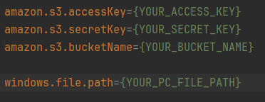

# File Uploading to AmazonS3 And Getting AmazonS3 Url

This project is for uploading file and getting them amazon s3 urls.
You can use an image url with jpg, png or jpeg extension to upload an image.
You can use a video url with mp4 extension to upload a video.
Then, you can get their amazon s3 urls.

But don't forget adding your amazon s3 info to application.properties.

